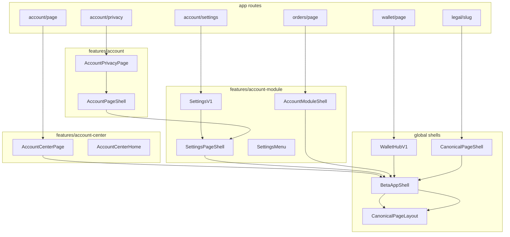

# ACCOUNT_ARCHITECTURE.md

**ROVEXO v1.0 — My Account + Settings**  
**Phase:** 1 of 3 (audit only)  
**Date:** 2026-07-12  
**Status:** No code modified during this phase.

This document is the full architectural audit required before reconstruction. Phases 2 (legacy removal) and 3 (rebuild) are **not started**.

**Companion artifacts:** `ROUTE_MAP.md` (Playwright click-through, 2026-07-12)

---

## 1. Executive summary

The My Account and Settings module is split across **three feature folders**, **five shell paradigms**, and **three menu-row systems**. It does not yet behave as one continuous canonical application.

| Metric | Count |
|--------|------:|
| Active routes (hub + destinations) | 45+ |
| `app/**/page.tsx` files in scope | 40 |
| Feature components (`account*` folders) | 55 |
| Shell / wrapper variants | 5 |
| Overlay components (modal/sheet) | 9 active |
| Confirmed unused / orphan files | 18 |
| Duplicate shell pairs | 2 (`SettingsPageShell` ≈ `AccountModuleShell`) |
| Duplicate menu-row stacks | 2 (`AccountMenuRow` vs `CanonicalMenuRow`) |

**Root cause:** Incremental migration layered canonical CDS primitives on top of legacy account-center, account-module, and account folders without deleting predecessors or unifying the shell.

**Target (Phase 3):** Single shell, single spacing, single form system — tree defined in §2.

---

## 2. Target architecture (Phase 3 spec)

```
My Account
├── My Listings          → /seller/listings
├── Orders               → /orders
├── Saved Items          → /saved
├── My Reviews           → /account/reviews
├── Wallet               → /wallet
│
├── Settings             → /account/settings
│   ├── Profile
│   │      ├── Personal Information
│   │      ├── Avatar
│   │      ├── Email
│   │      ├── Phone
│   │      └── Bio
│   ├── Payments
│   │      ├── Payment Methods
│   │      ├── Bank Account
│   │      └── Tax Information
│   ├── Notifications
│   │      ├── Notification Preferences
│   │      └── Marketing
│   ├── Privacy & Security
│   │      ├── Privacy
│   │      ├── Security
│   │      ├── Connected Accounts
│   │      ├── Devices & Sessions
│   │      └── Blocked Users
│   ├── Preferences
│   │      ├── Language
│   │      ├── Currency
│   │      └── Accessibility
│   └── Legal
│          ├── Legal Documents
│          ├── Terms
│          ├── Privacy Policy
│          └── Cookie Policy
│
├── Promotion Tools      → /account/promotion-tools
├── Help Centre          → /help
└── Ideas                → /account/ideas
```

**Gap vs current:** Profile is split across `ProfileViewV1` (read) + `ProfileEditPage` (edit) with no sub-route per field. Addresses live under Profile accordion but not in target tree. Hub uses `RovexoHeaderV2`; subpages use `CanonicalPageLayout` — visual discontinuity.

---

## 3. Route tree (current)

### 3.1 My Account hub (`/account`)

```
/account                                          AccountCenterPage
├── [profile header]        → /account/profile
├── [followers row]         → /account/followers
├── [stats: Listings]       → /seller/listings
├── [stats: Saved]          → /saved
├── [stats: Orders]         → /orders
├── [stats: Wallet]         → /wallet
│
├── MANAGE
│   ├── My Listings         → /seller/listings
│   ├── Orders              → /orders
│   ├── Saved Items         → /saved
│   ├── My Reviews          → /account/reviews
│   └── Wallet              → /wallet
│
├── ACCOUNT
│   ├── Settings            → /account/settings
│   └── Promotion Tools     → /account/promotion-tools
│       ├── /bump
│       ├── /store-featured
│       └── /boost
│
├── SUPPORT
│   ├── Help Centre         → /help (+ subtree)
│   └── Ideas               → /account/ideas
│
└── [Sign Out]              → server action (no route)
```

SSOT: `lib/account-center/canonical-menu.ts`

### 3.2 Settings hub (`/account/settings`)

```
/account/settings                                 SettingsV1
├── [accordion] Profile
│   ├── Profile             → /account/profile
│   └── Addresses           → /account/addresses
├── [accordion] Payments
│   ├── Payment Methods     → /account/payment-methods
│   ├── Bank Account        → /account/settings/bank-account
│   └── Tax Information     → /seller/tax
├── [accordion] Notifications
│   ├── Notification Prefs  → /notifications/settings
│   └── Marketing Prefs     → /account/privacy
├── [accordion] Privacy & Security
│   ├── Privacy             → /account/privacy
│   ├── Security            → /account/security
│   ├── Connected Accounts  → /account/security  (duplicate dest)
│   ├── Devices & Sessions  → /account/security  (duplicate dest)
│   └── Blocked Users       → /account/blocked-users
├── [accordion] Preferences
│   ├── Language            → /account/preferences/language
│   ├── Currency            → /account/preferences/currency
│   └── Accessibility       → /legal/accessibility-statement
├── [accordion] Legal
│   ├── Legal Documents     → /legal
│   ├── Terms               → /legal/terms-and-conditions
│   ├── Privacy Policy      → /legal/privacy-policy
│   └── Cookie Policy       → /legal/cookie-policy
└── [Delete Account]        → in-page modal (no route)
```

SSOT: `features/account-module/components/SettingsV1.tsx`

### 3.3 Wallet subtree

```
/wallet                                           WalletPage → WalletHubV1
├── /transactions
├── /transactions/[id]
├── /withdraw
├── /statements
├── /statements/[period]
├── /statements/annual
└── /statements/annual/[year]
```

### 3.4 Help subtree

```
/help                                             HelpCentrePage
├── /faq                                          HelpFaqPage
├── /policies                                     HelpPoliciesPage
├── /category/[slug]                              DecisionTreeWizard
│   └── buyer | seller | payments | shipping | orders | account | safety | reports
└── /[slug]                                       HelpArticlePage
```

### 3.5 Legal subtree

```
/legal                                            CanonicalPageShell (inline list)
└── /legal/[slug]                                 LegalDocumentPage
    ├── terms-and-conditions
    ├── privacy-policy
    ├── cookie-policy
    ├── accessibility-statement
    └── … (22 canonical documents in lib/legal/canonical-documents.ts)
```

### 3.6 Redirect-only / legacy routes

| Route | Resolves to | Mechanism |
|-------|-------------|-----------|
| `/account/orders` | `/orders` | `app/account/orders/page.tsx` |
| `/account/wallet` | `/wallet` | page redirect (+ `next.config` via `/seller/wallet`) |
| `/account/edit` | `/account/profile` | page redirect |
| `/account/verification` | `/account/settings` | page redirect |
| `/account/seller/shipping` | `/account/settings` | page redirect |
| `/seller/wallet` | `/wallet` | page redirect |
| `/seller/promotions` | `/account/promotion-tools` | page redirect |
| `/seller/tax` | `/account` | if `!profile.isSeller` |
| `/settings` | `/account/settings` | app redirect |
| `/terms`, `/privacy`, `/cookies` | `/legal/*` | legacy legal redirects |

### 3.7 Routes in codebase NOT in hub/settings SSOT

| Route | Component | Notes |
|-------|-----------|-------|
| `/account/profile/edit` | `ProfileEditPage` | Linked from `ProfileViewV1` |
| `/account/settings/about` | `SettingsAboutV1` | Not in accordion |
| `/account/preferences/timezone` | `AccountTimezonePage` | Orphan from settings menu |
| `/account/preferences/appearance` | `AccountAppearancePage` | Orphan from settings menu |
| `/account/buyer/preferences` | `AccountBuyerPreferencesPage` | Orphan |
| `/notifications/preferences` | `NotificationPreferences` | Different from `/notifications/settings` |
| `/account/bring-your-item` | `BringYourItemPage` / coming soon | Feature-flagged |
| `/buyer`, `/seller` | `AccountCenterModulePage` | Tile dashboards, same shell family |

---

## 4. Page inventory

### 4.1 `app/account/**`

| File | Route | Feature component | Shell used |
|------|-------|-------------------|------------|
| `page.tsx` | `/account` | `AccountCenterPage` | `BetaAppShell` + `RovexoHeaderV2` |
| `profile/page.tsx` | `/account/profile` | `ProfileViewV1` | `SettingsPageShell` |
| `profile/edit/page.tsx` | `/account/profile/edit` | `ProfileEditPage` | `AccountPageShell` |
| `followers/page.tsx` | `/account/followers` | `AccountFollowersPage` | `AccountModuleShell` |
| `settings/page.tsx` | `/account/settings` | `SettingsV1` | `SettingsPageShell` |
| `settings/bank-account/page.tsx` | `/account/settings/bank-account` | `SettingsBankAccountV1` | `SettingsPageShell` |
| `settings/about/page.tsx` | `/account/settings/about` | `SettingsAboutV1` | `SettingsPageShell` (in route) |
| `addresses/page.tsx` | `/account/addresses` | `AddressBookPage` | `SettingsPageShell` |
| `payment-methods/page.tsx` | `/account/payment-methods` | `PaymentMethodsPage` | `SettingsPageShell` |
| `privacy/page.tsx` | `/account/privacy` | `AccountPrivacyPage` | `AccountPageShell` |
| `security/page.tsx` | `/account/security` | `AccountSecurityPage` | `AccountPageShell` |
| `blocked-users/page.tsx` | `/account/blocked-users` | `AccountBlockedUsersPage` | `AccountPageShell` |
| `preferences/language/page.tsx` | `/account/preferences/language` | `AccountLanguagePage` | `AccountPageShell` |
| `preferences/currency/page.tsx` | `/account/preferences/currency` | `AccountCurrencyPage` | `AccountPageShell` |
| `preferences/timezone/page.tsx` | `/account/preferences/timezone` | `AccountTimezonePage` | `AccountPageShell` |
| `preferences/appearance/page.tsx` | `/account/preferences/appearance` | `AccountAppearancePage` | `AccountPageShell` |
| `buyer/preferences/page.tsx` | `/account/buyer/preferences` | `AccountBuyerPreferencesPage` | `AccountPageShell` |
| `reviews/page.tsx` | `/account/reviews` | `ReviewsV1` | `AccountModuleShell` |
| `ideas/page.tsx` | `/account/ideas` | `RovexoIdeasPage` | `AccountModuleShell` |
| `promotion-tools/page.tsx` | `/account/promotion-tools` | `PromotionToolsV1` | `SettingsPageShell` |
| `promotion-tools/[entry]/page.tsx` | `/account/promotion-tools/*` | `PromotionToolEntryV1` | `AccountModuleShell` |
| `bring-your-item/page.tsx` | `/account/bring-your-item` | BYI pages | `AccountModuleShell` |
| `orders/page.tsx` | redirect | — | — |
| `wallet/page.tsx` | redirect | — | — |
| `edit/page.tsx` | redirect | — | — |
| `verification/page.tsx` | redirect | — | — |
| `seller/shipping/page.tsx` | redirect | — | — |

### 4.2 Related `app/**` pages (reachable from hub/settings)

| File | Route | Feature component | Shell |
|------|-------|-------------------|-------|
| `orders/page.tsx` | `/orders` | `OrdersV1` | `AccountModuleShell` |
| `saved/page.tsx` | `/saved` | `SavedItemsV1` | `AccountModuleShell` |
| `wallet/page.tsx` | `/wallet` | `WalletPage` → `WalletHubV1` | `BetaAppShell` + `CanonicalPageHeader` |
| `seller/listings/page.tsx` | `/seller/listings` | `SellerListingsV1` | `AccountModuleShell` |
| `seller/tax/page.tsx` | `/seller/tax` | `SellerTaxRegistrationPage` | `BetaAppShell` + `CanonicalPageHeader` |
| `notifications/settings/page.tsx` | `/notifications/settings` | `NotificationSettingsPage` | `SettingsPageShell` |
| `notifications/preferences/page.tsx` | `/notifications/preferences` | `NotificationPreferences` | `SettingsPageShell` |
| `help/page.tsx` | `/help` | `HelpCentrePage` | `SettingsPageShell` |
| `help/faq/page.tsx` | `/help/faq` | `HelpFaqPage` | `BetaAppShell` + inner `SettingsPageShell` |
| `help/policies/page.tsx` | `/help/policies` | `HelpPoliciesPage` | `BetaAppShell` + inner `SettingsPageShell` |
| `help/category/[slug]/page.tsx` | `/help/category/*` | `DecisionTreeWizard` | `BetaAppShell` + inner `SettingsPageShell` |
| `help/[slug]/page.tsx` | `/help/[slug]` | `HelpArticlePage` | `BetaAppShell` + inner `SettingsPageShell` |
| `legal/page.tsx` | `/legal` | inline | `CanonicalPageShell` |
| `legal/[slug]/page.tsx` | `/legal/*` | `LegalDocumentPage` | `CanonicalPageShell` |
| `support/page.tsx` | `/support` | inline + `SupportForm` | `SettingsPageShell` |
| `support/success/page.tsx` | `/support/success` | `SupportSuccessPage` | `SettingsPageShell` |

### 4.3 Layout chain

```
app/layout.tsx                    ← ALL routes
  └── ThemeProvider, LocaleProvider, PwaProvider, ToastProvider, SearchProvider
      └── AppShellLayout
          └── {page}

app/seller/layout.tsx             ← /seller/* only (passthrough)
```

**No `app/account/layout.tsx`.** All chrome is in feature-level shells.

---

## 5. Component inventory

### 5.1 `features/account-center/` (19 files)

| Component | Role | Status |
|-----------|------|--------|
| `AccountCenterPage` | Hub wrapper | **Active** |
| `AccountCenterHome` | Hub body | **Active** |
| `AccountCanonicalProfile` | Profile header + followers link | **Active** |
| `AccountStatsStrip` | Listings/Saved/Orders/Wallet stats | **Active** |
| `AccountMenuSections` | Canonical menu + logout | **Active** |
| `AccountMenuRow` | Hub menu row (`ac-canonical__*`) | **Active** — duplicate of CDS row |
| `AccountFollowersPage` | Followers page | **Active** |
| `AccountCenterModulePage` | Buyer/seller tile hub | **Active** (`/buyer`, `/seller`) |
| `AccountModuleTileGrid` | Tile grid | **Active** |
| `NotificationBadge` | Badge on rows | **Active** |
| `useAccountHubLive` | Realtime hub data | **Active** |
| `AccountCenterHeader` | Legacy header | **UNUSED** |
| `AccountCenterBackButton` | Legacy back | **UNUSED** |
| `AccountHubProfile` | Legacy profile (`ac-hub__*`) | **UNUSED** |
| `AccountWalletCard` | Legacy wallet card | **UNUSED** |
| `AccountMenuList` | Deprecated flat menu | **UNUSED** |
| `AccountQuickAccessGrid` | Legacy quick grid | **UNUSED** |
| `AccountAvatarSheet` | Avatar sheet (in QuickAccessGrid file) | **UNUSED** |
| `AccountCenterLogoutButton` | Logout button | **Unreachable** |
| `AccountCenterDeleteButton` | Delete link | **Unreachable** |

### 5.2 `features/account-module/` (19 files)

| Component | Role | Status |
|-----------|------|--------|
| `SettingsPageShell` | Settings/module shell A | **Active** — duplicate of `AccountModuleShell` |
| `AccountModuleShell` | Settings/module shell B | **Active** — duplicate of `SettingsPageShell` |
| `SettingsV1` | Settings hub + bank panel | **Active** |
| `SettingsMenu` | Section/card/row/form wrappers | **Active** |
| `SettingsAccordion` | Settings hub accordion | **Active** |
| `settings-accordion.css` | Accordion styles | **Active** |
| `DeleteAccountFlow` | Delete account modals | **Active** |
| `ProfileViewV1` | Read-only profile | **Active** |
| `OrdersV1` | Orders list | **Active** |
| `SavedItemsV1` | Saved items | **Active** |
| `SellerListingsV1` | My listings | **Active** |
| `ReviewsV1` | My reviews | **Active** |
| `PromotionToolsV1` | Promotion hub | **Active** |
| `PromotionToolEntryV1` | Promotion entry page | **Active** (route exists, not hub-linked) |
| `RovexoIdeasPage` | Ideas form | **Active** |
| `BringYourItemPage` | Store migration | **Active** (feature-flag) |
| `BringYourItemComingSoonPage` | BYI placeholder | **Active** |
| `SettingsAboutV1` | About panel | **Active** (orphan route) |
| `VerificationHubV1` | Verification hub | **ORPHAN** (route redirects) |
| `AccountModuleBackHeader` | Legacy back header | **UNUSED** (`@deprecated`) |

### 5.3 `features/account/` (17 files)

| Component | Role | Status |
|-----------|------|--------|
| `AccountPageShell` | Adapter → `SettingsPageShell` | **Active** — compatibility layer |
| `AccountPrivacyPage` | Privacy + marketing | **Active** |
| `AccountSecurityPage` | Security hub | **Active** |
| `AccountBlockedUsersPage` | Blocked users | **Active** |
| `AccountLanguagePage` | Language | **Active** |
| `AccountCurrencyPage` | Currency | **Active** |
| `AccountTimezonePage` | Timezone | **Orphan route** |
| `AccountAppearancePage` | Theme | **Orphan route** |
| `AccountBuyerPreferencesPage` | Buyer prefs | **Orphan route** |
| `AccountSellerShippingPage` | Seller shipping | **ORPHAN** (route redirects) |
| `AddressBookPage` | Addresses | **Active** |
| `PaymentMethodsPage` | Payment methods | **Active** |
| `ProfileEditPage` | Profile edit | **Active** |
| `AvatarUploader` | Avatar upload | **Active** |
| `EmailChangeForm` | Email change | **Active** |
| `PasswordChangeForm` | Password change | **Active** |
| `CardSetupSheet` | Stripe card modal | **Active** |

### 5.4 `components/account/` (7 files) — **entire folder legacy**

| File | Status |
|------|--------|
| `AccountIcons.tsx` | **Active** (used by hub menu) |
| `account-nav.ts` | **UNUSED** (legacy 16-tile grid) |
| `MyAccountGrid.tsx` | **UNUSED** |
| `MyAccountCard.tsx` | **UNUSED** |
| `ProfileCard.tsx` | **UNUSED** |
| `StatisticsRow.tsx` | **UNUSED** |
| `TrustAnalytics.tsx` | **UNUSED** |

### 5.5 `features/settings/components/` (account-adjacent)

| Component | Used by account? |
|-----------|------------------|
| `LanguagePicker` | `AccountLanguagePage` |
| `AppearancePicker` | `AccountAppearancePage` |
| `SettingSection` | `NotificationSettingsPage`, `NotificationPreferences` only |
| `SettingToggle` | Notification pages |
| `ConfirmDialog` | **Not** in account flows |

### 5.6 Global CDS primitives (keep in Phase 2)

From `src/components/canonical/`:

- `CanonicalPageLayout` — page header + back + body
- `CanonicalMenuRow`, `CanonicalCard`, `CanonicalSection`
- `CanonicalButton`, `CanonicalButtonLink`, `CanonicalInput`, `CanonicalTextarea`
- `CanonicalSelector`, `CanonicalSwitch`, `CanonicalCheckbox`, `CanonicalRadio`
- `CanonicalModal`, `CanonicalInfoBlock`, `CanonicalDivider`
- `CanonicalAccountMenuRow` — **exported but never used in app code**

---

## 6. Shell architecture (current)

```
BetaAppShell                          ← bottom nav + notifications provider
│
├── AccountCenterPage                 ← /account ONLY
│   ├── RovexoHeaderV2                ← DIFFERENT header paradigm
│   └── ScrollContainer
│
├── SettingsPageShell                 ← default back: /account/settings
│   └── CanonicalPageLayout
│
├── AccountModuleShell                ← default back: /account (NEAR-DUPLICATE)
│   └── CanonicalPageLayout
│
├── AccountPageShell                  ← thin wrapper
│   └── SettingsPageShell
│
├── CanonicalPageShell                ← /legal/*
│   ├── CanonicalPageHeader           ← DIFFERENT header component
│   └── ScrollContainer
│
└── WalletHubV1 / SellerTaxRegistrationPage
    ├── BetaAppShell (direct)
    └── CanonicalPageHeader           ← THIRD header variant
```

### Shell usage matrix

| Shell | Routes |
|-------|--------|
| `AccountCenterPage` | `/account` |
| `SettingsPageShell` | settings hub, profile view, addresses, payments, bank, promotion hub, help*, notifications/settings, support* |
| `AccountPageShell` → `SettingsPageShell` | privacy, security, blocked, language, currency, timezone, appearance, buyer prefs, profile edit |
| `AccountModuleShell` | orders, saved, listings, reviews, ideas, promotion entry, followers, BYI |
| `CanonicalPageShell` | `/legal`, `/legal/[slug]` |
| `WalletHubV1` (direct `BetaAppShell`) | `/wallet` + wallet children |
| `SellerTaxRegistrationPage` (direct `BetaAppShell`) | `/seller/tax` |

**Continuity violations:**
1. Hub uses `RovexoHeaderV2`; all children use `CanonicalPageLayout` or `CanonicalPageHeader`
2. Help routes double-wrap: page-level `BetaAppShell` + inner `SettingsPageShell`
3. Legal uses `CanonicalPageShell` (different max-width / header)
4. Wallet uses `CanonicalPageHeader` without `CanonicalPageLayout`
5. `SettingsPageShell` vs `AccountModuleShell` differ only in `backHref` default and `data-*` attribute

---

## 7. Modals, sheets, and dialogs

### 7.1 Active overlays

| Component | Path | Primitive | Triggered from |
|-----------|------|-----------|----------------|
| `DeleteAccountFlow` | `features/account-module/components/DeleteAccountFlow.tsx` | 2× `CanonicalModal` | `/account/settings` |
| `CardSetupSheet` | `features/account/components/CardSetupSheet.tsx` | `CanonicalModal` | `/account/payment-methods` |
| `BankAccountForm` | `features/wallet/components/BankAccountForm.tsx` | `CanonicalModal` | `/account/settings/bank-account` |
| `BankAccountModalLazy` | inline in `SettingsV1.tsx` | lazy-loads above | bank account page |
| `PromotionListingPicker` | `components/promotions/cards-v1/PromotionListingPicker.tsx` | `CanonicalModal` | promotion tools |
| `PromotionPackagePicker` | `components/promotions/cards-v1/PromotionPackagePicker.tsx` | `CanonicalModal` | promotion tools |
| Listing delete modal | inline in `SellerListingsV1.tsx` | `CanonicalModal` | `/seller/listings` |
| `ShareListingSheet` | `components/share/ShareListingSheet.tsx` | `ModalContainer` (legacy) | `/seller/listings` |
| `PromotionPicker` | `features/seller/listings/components/PromotionPicker.tsx` | `ModalContainer` (legacy) | `/seller/listings` |

### 7.2 Overlay primitive split

| Primitive | Path | Account usage |
|-----------|------|---------------|
| `CanonicalModal` | `src/components/canonical/CanonicalModal.tsx` | Canonical account flows |
| `ModalContainer` | `components/ui/ModalContainer.tsx` | Share + promote on listings (legacy) |
| `Dialog` / `Modal` | `components/ui/Dialog.tsx` | Not used in account |
| `ConfirmDialog` | `features/settings/components/ConfirmDialog.tsx` | Not used in account |

### 7.3 Orphan overlays

| Component | Notes |
|-----------|-------|
| `AccountAvatarSheet` | In `AccountQuickAccessGrid.tsx`; only referenced by dead `ProfileCard` |
| `WalletOverview` + `BankAccountForm` | No active route |
| `PromotionCardsPage` + `PromotionListingPicker` | No `app/` route |
| `SellerListingsPage` | Uses `window.confirm` + `PromotionPicker`; no route |

### 7.4 Pages with NO overlays

Hub, addresses, security, privacy, blocked users, preferences, profile view, ideas, reviews, followers, notification settings, help (inline wizards only), wallet hub.

---

## 8. Duplicated components

### 8.1 Shell duplicates

| A | B | Diff |
|---|---|------|
| `SettingsPageShell` | `AccountModuleShell` | `backHref` default, `data-settings-version` vs `data-account-module-version`, `className` handling |
| `AccountPageShell` | `SettingsPageShell` | Optional subtitle paragraph only |
| `CanonicalPageLayout` | `CanonicalPageHeader` + `ScrollContainer` | Different layout compositions on legal/wallet/tax |

### 8.2 Menu / row duplicates

| Stack | CSS namespace | Used on |
|-------|---------------|---------|
| `AccountMenuRow` | `ac-canonical__*` | Hub menu |
| `SettingsMenuRow` → `CanonicalMenuRow` | `cds-menu-row` | Settings + children |
| `CanonicalAccountMenuRow` | CDS | **Never imported** |

### 8.3 Section duplicates

| A | B | Diff |
|---|---|------|
| `SettingsMenuSection` | `SettingSection` |后者 bundles `CanonicalCard variant="list"` |
| `SettingsFormPanel` | `SettingsMenuCard` | Form vs list card variants |

### 8.4 Profile duplicates (active)

| Component | Route / context |
|-----------|-----------------|
| `AccountCanonicalProfile` | Hub header |
| `ProfileViewV1` | `/account/profile` read view |
| `ProfileEditPage` | `/account/profile/edit` edit form |

Target Phase 3 wants single Profile section with sub-fields — current has 3 presentations.

### 8.5 Form duplicates

| Form | Pages |
|------|-------|
| `EmailChangeForm` | `ProfileEditPage`, potentially security |
| `PasswordChangeForm` | `ProfileEditPage`, `AccountSecurityPage` |
| Inline `react-hook-form` panels | privacy, blocked, currency, timezone, addresses |

---

## 9. Duplicated pages

| Concept | Implementations | Notes |
|---------|-----------------|-------|
| Profile | `ProfileViewV1` + `ProfileEditPage` | Read vs edit split |
| Privacy / Marketing | Same `AccountPrivacyPage` at `/account/privacy` | Two settings rows → one page |
| Security / Connected / Devices | Same `AccountSecurityPage` at `/account/security` | Three rows → one page |
| Notification prefs | `/notifications/settings` vs `/notifications/preferences` | Two routes, one in accordion |
| Promotion tools | `PromotionToolsV1` (hub) vs `PromotionToolEntryV1` (`[entry]`) | Hub uses modals; entry route legacy |
| My Listings | Stats strip + menu row | Same `/seller/listings` |
| Wallet | Stats strip + menu row | Same `/wallet` |
| Orders / Saved | Stats strip + menu row | Same destinations |

---

## 10. Shared / reusable components (keep)

These are the global canonical building blocks the rebuild should use exclusively:

```
src/components/canonical/
  CanonicalPageLayout      ← single page shell (header + back + body)
  CanonicalMenuRow
  CanonicalCard
  CanonicalSection
  CanonicalButton / CanonicalButtonLink
  CanonicalInput / CanonicalTextarea
  CanonicalSelector / CanonicalSwitch / CanonicalCheckbox / CanonicalRadio
  CanonicalModal
  CanonicalInfoBlock
  CanonicalDivider

components/beta/BetaAppShell.tsx     ← app chrome (bottom nav)
components/ui/Avatar.tsx
components/account/AccountIcons.tsx  ← hub menu icons only
```

**Do not keep as module-specific:** `SettingsPageShell`, `AccountModuleShell`, `AccountPageShell`, `SettingsMenu*`, `AccountMenuRow`, `CanonicalPageShell` (for account routes), `RovexoHeaderV2` on account hub (Phase 3 should unify header).

---

## 11. Unused components (delete candidates — Phase 2)

| File | Evidence |
|------|----------|
| `features/account-center/components/AccountHubProfile.tsx` | Zero imports |
| `features/account-center/components/AccountCenterHeader.tsx` | Zero imports |
| `features/account-center/components/AccountCenterBackButton.tsx` | Only used by dead header |
| `features/account-center/components/AccountWalletCard.tsx` | Zero imports |
| `features/account-center/components/AccountMenuList.tsx` | `@deprecated`, zero external imports |
| `features/account-center/components/AccountQuickAccessGrid.tsx` | Grid never imported |
| `features/account-module/components/VerificationHubV1.tsx` | Route redirects; zero imports |
| `features/account-module/components/AccountModuleBackHeader.tsx` | `@deprecated`, zero imports |
| `features/account/components/AccountSellerShippingPage.tsx` | Route redirects |
| `src/components/canonical/CanonicalAccountMenuRow.tsx` | Re-export only; tests forbid use |
| `components/account/MyAccountGrid.tsx` | Zero route imports |
| `components/account/MyAccountCard.tsx` | Only used by dead grid |
| `components/account/ProfileCard.tsx` | Zero imports |
| `components/account/StatisticsRow.tsx` | Only used by dead ProfileCard |
| `components/account/TrustAnalytics.tsx` | Only used by dead ProfileCard |
| `components/account/account-nav.ts` | Only used by dead grid |
| `features/wallet/components/WalletOverview.tsx` | No active route |
| `components/promotions/cards-v1/PromotionCardsPage.tsx` | No `app/` route |

**Unreachable (imported but never rendered):**
- `AccountCenterLogoutButton.tsx` — `showLogout` never true
- `AccountCenterDeleteButton.tsx` — same

---

## 12. Dependency trees

### 12.1 Hub dependency tree

```
app/account/page.tsx
└── AccountCenterPage
    ├── BetaAppShell
    ├── RovexoHeaderV2
    ├── ScrollContainer
    └── AccountCenterHome
        ├── useAccountHubLive
        ├── AccountCanonicalProfile
        │   └── Avatar
        ├── AccountStatsStrip
        └── AccountMenuSections
            ├── buildAccountMenuSections (lib/account-center/canonical-menu.ts)
            ├── AccountMenuRow
            ├── AccountIcon (components/account/AccountIcons)
            ├── useRealtimeNotifications
            └── signOut (lib/auth/actions)
```

### 12.2 Settings hub dependency tree

```
app/account/settings/page.tsx
└── SettingsV1
    ├── SettingsPageShell
    │   ├── BetaAppShell
    │   └── CanonicalPageLayout
    ├── SettingsPageBody
    ├── SettingsAccordion
    │   ├── CanonicalCard
    │   └── CanonicalMenuRow
    └── DeleteAccountFlow
        ├── SettingsMenuRow → CanonicalMenuRow
        └── CanonicalModal × 2
```

### 12.3 Settings child page pattern (representative)

```
app/account/privacy/page.tsx
└── AccountPrivacyPage
    └── AccountPageShell
        └── SettingsPageShell
            ├── BetaAppShell
            └── CanonicalPageLayout
                ├── SettingsMenuSection → CanonicalSection
                ├── SettingsMenuCard → CanonicalCard
                ├── SettingsFormPanel → CanonicalCard
                ├── CanonicalButton / Checkbox / Selector / InfoBlock
                └── react-hook-form
```

### 12.4 Module page pattern (representative)

```
app/orders/page.tsx
└── OrdersV1
    └── AccountModuleShell
        ├── BetaAppShell
        └── CanonicalPageLayout
            ├── CanonicalInfoBlock
            └── CanonicalMenuRow
```

### 12.5 Cross-folder import graph (simplified)



### 12.6 `lib/account-center/` dependencies

| File | Consumed by |
|------|-------------|
| `canonical-menu.ts` | `AccountMenuSections`, tests |
| `snapshot.ts` | Hub page, reviews, followers |
| `derive.ts` | Profile, followers formatting |
| `format-profile-rating.ts` | `AccountCanonicalProfile` |
| `promotion-tools.ts` | Promotion entry routes |
| `modules.ts` | Tile dashboards (buyer/seller) |
| `tile-icons.ts` | `AccountModuleTileGrid` |
| `realtime.ts` | `useAccountHubLive` |
| `quick-access-premium.ts` | Dead quick-access grid |
| `premium-icons.ts` | Dead quick-access grid |
| `badges.ts`, `constants.ts`, `profile-stats.ts` | Hub snapshot |

---

## 13. CSS / styling fragmentation

| Stylesheet / class prefix | Used by |
|---------------------------|---------|
| `styles/rovexo/account-canonical-v2.css` | Hub (`ac-canonical__*`) |
| `styles/rovexo/header-v2.css` | Hub header |
| `acm-shell`, `acm`, `data-settings-version` | Settings/module shells |
| `cds-*` (canonical design system) | SettingsMenu, CDS primitives |
| `settings-accordion.css` | Settings accordion |
| `account-center-tile__*` | Tile dashboards |
| `account-center-quick__*` | Dead quick-access |

Phase 3 must collapse to **one** spacing/typography token source (`--cds-*`).

---

## 14. Phase 2 deletion plan (preview — not executed)

### 14.1 Delete entire legacy folders/files

- `components/account/MyAccountGrid.tsx`
- `components/account/MyAccountCard.tsx`
- `components/account/ProfileCard.tsx`
- `components/account/StatisticsRow.tsx`
- `components/account/TrustAnalytics.tsx`
- `components/account/account-nav.ts`
- All UNUSED files in §11

### 14.2 Merge / replace (not delete business logic)

| Remove | Replace with |
|--------|--------------|
| `SettingsPageShell` + `AccountModuleShell` + `AccountPageShell` | Single `AccountCanonicalShell` using `CanonicalPageLayout` |
| `SettingsMenuSection/Card/Row/FormPanel` | Direct CDS primitives |
| `AccountMenuRow` | `CanonicalMenuRow` with hub styling variant |
| `SettingSection` | `CanonicalSection` + `CanonicalCard` |
| `CanonicalPageShell` on account-linked legal | Same shell as settings children |
| `RovexoHeaderV2` on hub | `CanonicalPageLayout` hub variant |
| Help double `BetaAppShell` | Single shell at route or feature level |

### 14.3 Route consolidation candidates

| Current | Target |
|---------|--------|
| `/account/profile` + `/account/profile/edit` | `/account/settings/profile` with sections |
| `/account/addresses` | Under Profile in target tree (or keep as sub-route) |
| `/notifications/preferences` | Merge into `/notifications/settings` or Marketing |
| `/account/preferences/timezone`, `/appearance` | Remove or fold into Preferences |
| `/account/settings/about` | Fold into Legal or remove |
| `/account/promotion-tools/[entry]` | Remove if hub modals are SSOT |
| Redirect stubs (`orders`, `wallet`, `edit`, `verification`, `seller/shipping`) | Keep redirects, delete dead components |

---

## 15. Phase 3 rebuild checklist (preview — not executed)

- [ ] One `AccountCanonicalShell` for hub + all children
- [ ] One header/back button via `CanonicalPageLayout`
- [ ] Settings as nested route group with shared layout
- [ ] Profile sub-sections: Personal Info, Avatar, Email, Phone, Bio
- [ ] All forms use CDS inputs/switches/selectors
- [ ] All modals use `CanonicalModal` only
- [ ] Migrate `ShareListingSheet` + `PromotionPicker` off `ModalContainer`
- [ ] Hub menu uses `CanonicalMenuRow`
- [ ] Remove `features/account/` folder — fold into single `features/account/` canonical module
- [ ] Collapse `account-module` + `account-center` into one feature boundary

---

## 16. Validation scope (for Phase 3)

When rebuild completes, run:

| Check | Command |
|-------|---------|
| TypeScript | `npm run typecheck` or `tsc --noEmit` |
| ESLint | `npm run lint` |
| Production build | `npm run build` |
| Vitest | `npm test` |
| Playwright | account/settings navigation suite |

Deliverable: `FINAL_ACCOUNT_REBUILD_REPORT.md`

---

## 17. Audit conclusions

1. **Five shell paradigms** break continuity — hub header ≠ child header ≠ legal ≠ wallet.
2. **Two near-duplicate shells** (`SettingsPageShell` / `AccountModuleShell`) exist solely for `backHref` defaults.
3. **`AccountPageShell` is a compatibility adapter** — forbidden pattern per rebuild spec.
4. **18+ files are dead code** — safe to delete in Phase 2.
5. **Three menu-row implementations** — only `CanonicalMenuRow` should survive.
6. **Dual modal primitives** (`CanonicalModal` vs `ModalContainer`) on selling flows.
7. **Profile is fragmented** across 3 components; target tree wants unified Profile with sub-sections.
8. **Settings accordion links duplicate destinations** (privacy×2, security×3) — UX debt, not separate pages.
9. **Help pages double-wrap shells** — causes inconsistent scroll/spacing.
10. **No `app/account/layout.tsx`** — Phase 3 should add shared layout for true continuity.

**Phase 1 complete. Awaiting approval to begin Phase 2 (legacy removal).**
