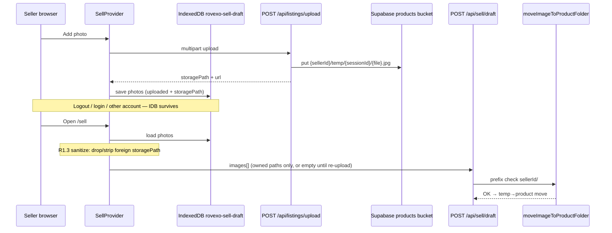

# R1.3 SELL DRAFT PIPELINE REPORT — COD SÂNGE

**STATUS:** RESTORE REPAIR APPLIED · WAITING OWNER VERIFICATION  
**DATE:** 2026-08-04  
**LOCK:** No commit · No push · No deploy  

---

## Verdict

| Item | Result |
|------|--------|
| Root cause | IndexedDB draft photos restored with `storagePath` not owned by current `auth.user.id` |
| Repository validation | **Correct — unchanged** |
| Upload / storage engines | **Unchanged** |
| Repair | Sanitize **draft restore only** |
| Unit tests | `tests/draft-restore-sanitize-v1.test.ts` — **6/6 PASS** |

---

## Sequence diagram



---

## Root cause

**Stale IndexedDB restore is not account-scoped.**  
After seller switch (or any session where restored `storagePath` prefix ≠ current user id), autosave/create draft sent foreign paths into `createSellerListing` → `moveImageToProductFolder` threw `Invalid image storage path.` → listing rolled back.

Expected:

```text
{currentSellerId}/temp/{sessionId}/{filename}.jpg
```

Actual at failure (class):

```text
path where startsWith(currentSellerId + "/") === false
```

(often `{previousSellerId}/temp/...`; literal not logged by server)

**First divergence:** client restore of IndexedDB photos — **before** repository.

---

## Files changed

| File | Change | Why safe |
|------|--------|----------|
| `lib/sell/draft-restore-sanitize-v1.ts` | **NEW** — ownership check + sanitize + `loadSanitizedDraftPhotos` | Restore-only; mirrors existing prefix rule; no repo/upload edits |
| `lib/product-integration/upload-storage-orchestration-v1.ts` | Draft **load** calls `loadSanitizedDraftPhotos` | Does not change upload transport, retries, or storage backend |
| `tests/draft-restore-sanitize-v1.test.ts` | **NEW** unit coverage | Proves Scenario C scrub behavior |

**Not changed:** repository, upload route, validation rules, DB schema, buckets, UI, routes, auth, middleware.

---

## Scenario mapping

| Scenario | Expected after repair |
|----------|----------------------|
| A — New listing + new upload + publish | Unaffected upload/publish path |
| B — Valid owned draft restore + publish | Owned `storagePath` kept |
| C — Corrupted foreign IndexedDB | Auto strip/discard → re-upload → draft/publish |

---

## Owner verification (required)

On `http://localhost:3000` (hard refresh after pull of these files):

1. **Scenario A:** New Sell → upload → draft/publish succeeds.  
2. **Scenario B:** Owned draft still restores and publishes.  
3. **Scenario C:** If a foreign `storagePath` was in IndexedDB, restore no longer POSTs it; console has **zero** `Invalid image storage path` / POST 500 from that cause.

Console targets: ChunkLoadError 0 · Hydration 0 · Image400 0 · Invalid image storage path 0.

---

## STOP

No commit. No push. No deploy. Waiting for Owner verification.
