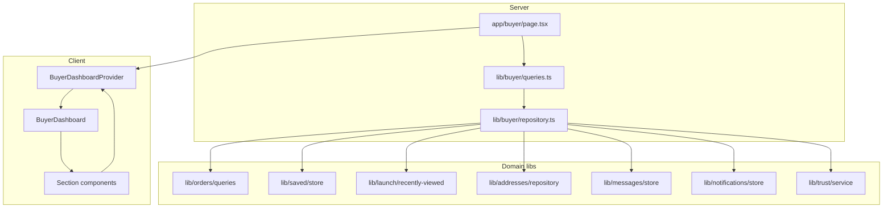

# Buyer Dashboard — Architecture

## Overview

The Buyer Dashboard is a server-rendered Next.js page with a client composition tree. Data is fetched once on the server and passed into a React context provider for section components.

## Layer diagram

## Key types

`types/buyer/dashboard.ts` defines `BuyerDashboardData` — the aggregate DTO consumed by all sections.

## Repository responsibilities

`fetchBuyerDashboardRepository(profile)`:

1. Parallel-fetch trust, orders, saved items, recently viewed, addresses, conversations, notifications
2. Derive statistics, protection summary, reviews summary
3. Build quick-action config from constants
4. Return unified `BuyerDashboardData`

## Hooks

`hooks/buyer/BuyerDashboardProvider.tsx` exposes `useBuyerDashboard()` — read-only context for section components.

## Lazy loading

`BuyerDashboard.tsx` dynamically imports sections below the fold (order history through support) with skeleton fallbacks.

## Error boundary

`app/buyer/error.tsx` renders `BuyerErrorState` with retry via Next.js error boundary reset.

## Styling

`styles/rovexo-buyer-dashboard.css` — module-scoped BEM-style classes with CSS custom properties for tokens. Does not import or modify `rovexo-homepage.css`.

## Extension points (future)

| Feature | Prepared via |
|---------|----------------|
| Theme engine | CSS variables on `.buyer-page` |
| Glass icons | `RovexoIcon` + `IconTheme.mode` |
| Wallet | Quick-action href + payments section |
| AI assistant | Support section link to `/assistant` |
| Stripe | `BuyerPayments` placeholder cards |

## Forbidden patterns

- Direct `createClient()` in `components/buyer/*`
- Duplicate listing card implementations
- Alternate dashboard entry components
- Modifications to `components/home/RovexoHomePage.tsx`
