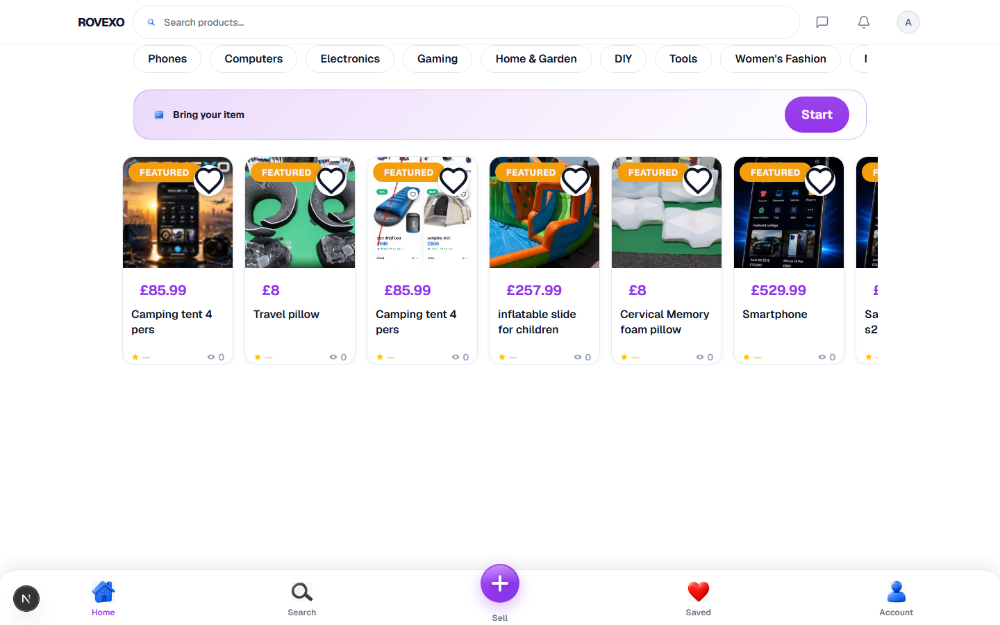

# Homepage Hydration — Final Fix Report

**Date:** 2026-07-06  
**URL verified:** http://127.0.0.1:3033/  
**Result:** PASS — zero hydration console errors (errors + warnings)

## Root cause

The primary hydration risk on the homepage was **unstable client-only markup leaking into the SSR tree**:

| Component | Issue | Symptom |
|-----------|-------|---------|
| `HomepageSearchField` | Combobox ARIA (`role`, `aria-expanded`, `aria-controls`) and suggestion panel could diverge between server and first client render | React attribute mismatch on the search input |
| `ListingCard` | `toLocaleString()` without locale — Node vs browser locale formatting | Text content mismatch on prices |
| `ListingCard` | `Date.now()` in `formatCountdown()` during render | Auction countdown text mismatch |

Secondary: E2E only scanned `console.error`, missing React hydration messages logged as `console.warning`.

## Files modified

| File | Change |
|------|--------|
| `lib/react/use-client-hydrated.ts` | **New** — shared `useSyncExternalStore` hydration gate |
| `components/home/HomepageSearchField.tsx` | Uses shared hook; stable `role="searchbox"` until hydrated; combobox ARIA deferred; fetch effect lint-safe |
| `components/ui/ListingCard.tsx` | `en-GB` price formatting; auction countdown deferred until hydrated |
| `e2e/sell-hydration.spec.ts` | Captures warnings + `server rendered html` pattern; 2.5s post-load hydration window |
| `tests/home-hydration.test.ts` | Updated assertions for new patterns |
| `scripts/homepage-hydration-audit.mjs` | **New** — deep audit (networkidle + warnings) |

## Before / After

### Before
- Search input rendered full combobox ARIA immediately; suggestion/spinner/clear UI gated but `role="combobox"` + `aria-expanded` could still mismatch in edge cases.
- Prices used `toLocaleString()` — locale-dependent between Node SSR and browser.
- Auction cards called `Date.now()` during render — countdown text differed by milliseconds/seconds at hydration.
- E2E ignored `console.warning` hydration messages.

### After
- **SSR + first client render identical:** search uses `role="searchbox"`, `aria-expanded={false}` until `useClientHydrated()` is true; combobox ARIA and suggestions panel only activate post-hydration.
- **Prices:** always `toLocaleString("en-GB")` — stable `£1,218.99` formatting.
- **Auction countdown:** `null` during SSR/first paint; computed only after hydration.
- **Verification:** Playwright audit captures errors **and** warnings; 2.5s wait after DOM load for hydration to complete.

## Validation

```
npm run build          ✅ PASS
npx vitest run tests/home-hydration.test.ts   ✅ 5/5 PASS
node scripts/homepage-hydration-audit.mjs     ✅ PASS (desktop + mobile)
npx playwright test e2e/sell-hydration.spec.ts --grep homepage  ✅ PASS
```

## Screenshot



## Console (zero hydration errors)

```
PASS — zero hydration console errors

hydrationHits: []
```

Note: 401/429 network errors from unauthenticated API badge fetches are expected and are **not** hydration errors.
